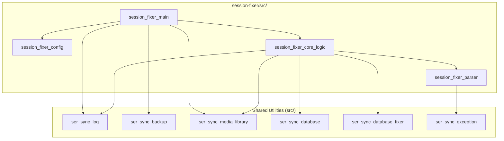

# Session Fixer - Codebase Guide

Developer documentation for the session-fixer standalone tool.

## Overview

Session-fixer repairs broken file paths in Serato's `.session` history files. It's a standalone tool separate from the main ser-sync-pro application.

## Source Files

| File | Purpose |
|------|---------|
| `session_fixer_main.java` | Entry point - orchestrates backup, scanning, and fixing |
| `session_fixer_config.java` | Loads settings from `session-fixer.properties` |
| `session_fixer_core_logic.java` | Scans sessions for broken paths, finds fixes, updates files |
| `session_fixer_parser.java` | Parses/writes Serato `.session` binary format |

---

## Architecture



---

## Key Classes

### `session_fixer_main`

Entry point. Flow:

1. Load config
2. Create backup (optional)
3. Scan music libraries
4. Delete short sessions (optional)
5. Fix broken paths

### `session_fixer_config`

Reads `session-fixer.properties`:

- `music.library.filesystem` — Comma-separated paths to scan
- `music.library.serato` — Path to `_Serato_` folder
- `backup.enabled` — Create backup before changes
- `session.min.duration` — Delete sessions shorter than N minutes

### `session_fixer_core_logic`

Core path-fixing logic:

- `fixBrokenPaths()` — Main repair method (uses parallel processing)
- `deleteShortSessions()` — Removes sessions under minimum duration

### `session_fixer_parser`

Binary parser for `.session` files:

- `readFrom(File)` — Parse session file
- `writeTo(File)` — Write modified session
- `updatePath(old, new)` — Replace path in binary data
- `getUniquePaths()` — Extract all track paths
- `getSessionDurationSeconds()` — Calculate session length

---

## Dependencies on Shared Utilities

| Utility | Used For |
|---------|----------|
| `ser_sync_log` | Logging |
| `ser_sync_backup` | Creating _Serato_ backups |
| `ser_sync_media_library` | Scanning music folders |
| `ser_sync_database` | Reading database V2 paths |
| `ser_sync_database_fixer` | Updating database V2 paths |
| `ser_sync_exception` | Custom exceptions |

---

## Building

```bash
ant session-fixer-jar
```

Output: `distr/session-fixer/session-fixer.jar`

---

## Related

- [README.md](README.md) — User documentation
- [Main CODEBASE_GUIDE.md](../CODEBASE_GUIDE.md) — Full project documentation
- [SESSION_FORMAT_GUIDE.md](SESSION_FORMAT_GUIDE.md) — Technical guide to .session file structure
